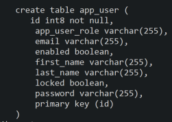
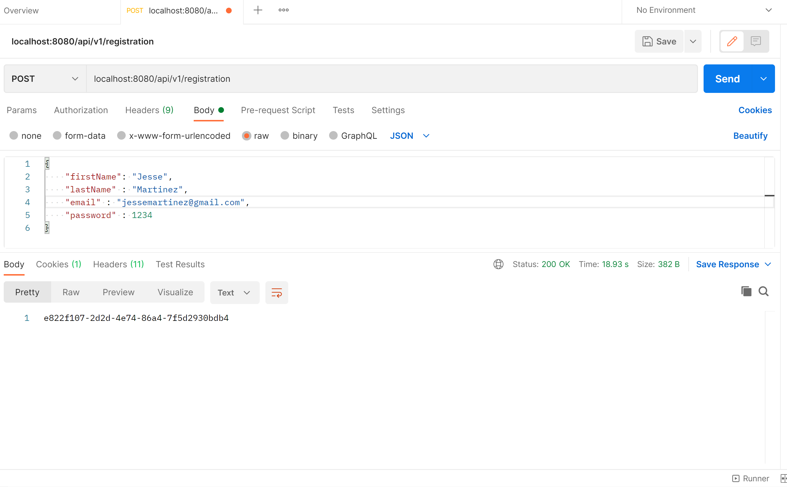

# User_Login_Spring_Java
 # BackEnd Login Registration
 
 This is a complete Login backend system using Spring Boot.
 
	✔️ Java (BackEnd)
  ✔️ SpringBoot \
  ✔️ Spring Security \
  ✔️ E-Mail Verification w/ Expiry \
  ✔️ HTML \
  ✔️ PostgresSQL \
  ✔️ MailDEv (SMTP Server used for generating email verification) 
  
  
  ## The application works by running the app from the IDE 
  ### Table created and sent to PostGres
  
  
  ## Then Postman is used to POST the Values into the table
  ### POSTMAN
  
  
  ## After POST is executed a TOKEN is generated and the EMAIL is sent to the MailDev server for verification
  ### MailDev Verify
  
   

  
  
  
  
  
  
 
 
